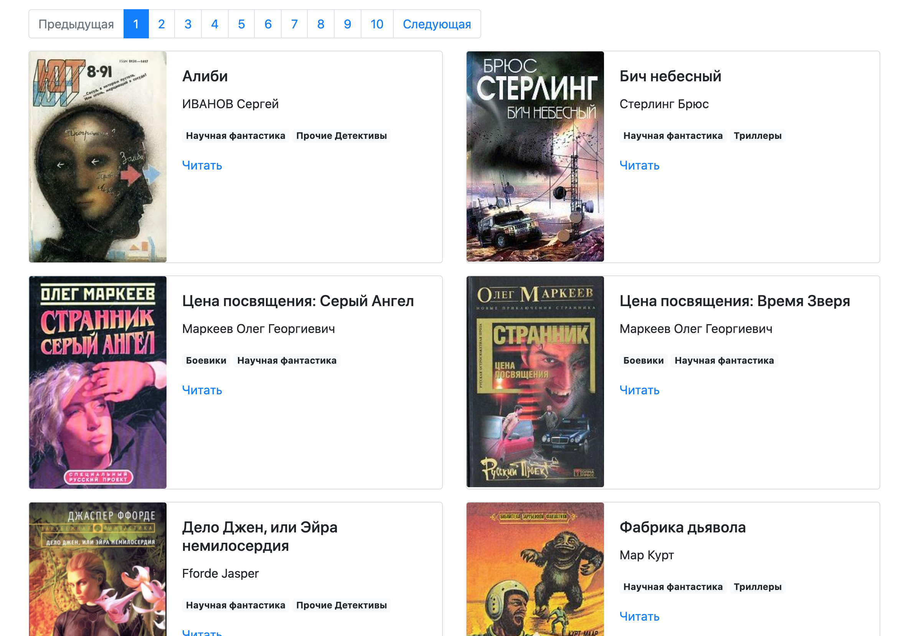

## Online library

Simple site of online library on bootstrap. Books are from free online library [tululu.org](https://tululu.org).

Demo is here: [online library.](https://ekbdizzy.github.io/dvmn-online-library/)

## Use offline

Open file `index.html` in browser you like.

## Before start install requirements

~~~
pip install -r requirements.txt
~~~

## Working with parser

Script `parse_tululu_category.py` has cli args:

1. `--dest_folder`: destination folder of all downloads. Default: current directory.
2. `--json_path`: destination folder of json_file with books info. Default: `./books_info.json`
3. `--skip_imgs`: skip downloading images.
4. `--skip_txt`: skip downloading txt.
5. `--start_page`: - first page number to parse.
6. `--end_page`: last page number to parse.

Usage:

~~~
python parse_tululu_category.py --dest_folder books --start_page 10 --end_page 15 --skip_imgs 
~~~

More info:

~~~
python parse_tululu_category.py -h
~~~

## Start project on dev

Before start you need to download books and titles. Use `parse_tululu_parser.py`:

~~~
python parse_tululu_category.py
~~~

After books are parsed you should render html pages and run server:

~~~
python render_website.py
~~~

Site will be available on `localhost:5500`.

## Credential

Project is created as a lesson in [Devman](https://dvmn.org/modules/website-layout-for-pydev/). 

