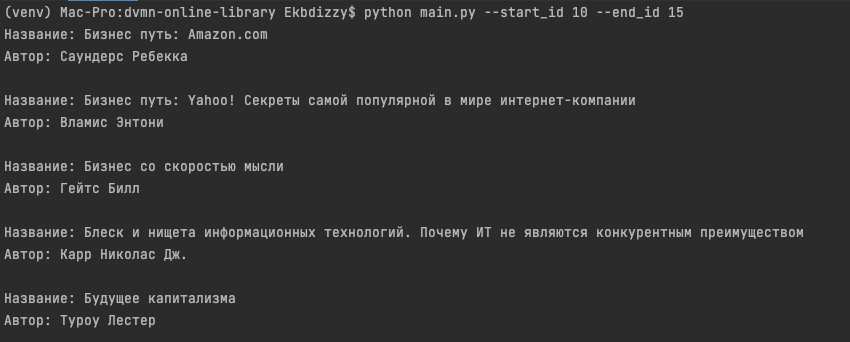

## Books parser from tululu.org

This scripts helps to parse books credentials (title, author, comments) and download it in *.txt format and cover image.

Books are parsing from free online library [tululu.org](https://tululu.org).

## Before start install requirements

~~~
pip install -r requirements.txt
~~~

## Working with project

Script `main.py` has cli args:

1. `--start_id` - first book_id of parse list, integer, default = 0.
2. `--end_id` - last book_id of parse list, integer, default = 10.

Usage:

~~~
python main.py --start_id 20 --end_id 30
~~~

More info:

~~~
python main.py -h
~~~

## Credential

Project created as a lesson in [Devman](https://dvmn.org/modules/website-layout-for-pydev/). 

